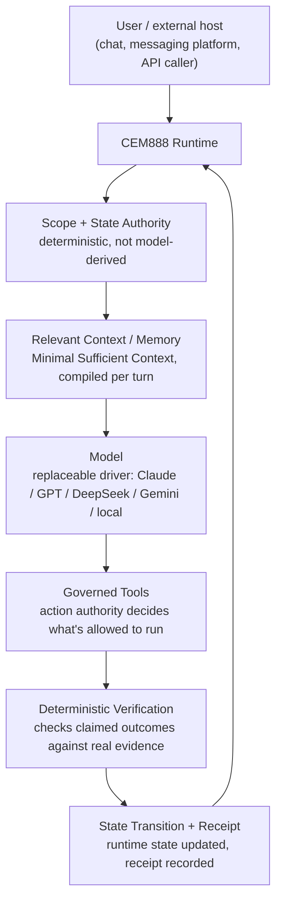

# Architecture (conceptual)

This is the request/turn flow CEM888's runtime enforces, at the level needed to evaluate whether the engineering claims in this organization are credible — not an implementation guide.

## What each stage does

**Scope + State Authority.** Before the model is ever called, the runtime resolves what's actually true for this turn — whose session this is, what's already been established, what authority a given correction carries. This step is deterministic: it doesn't depend on the model's memory of the conversation, and it doesn't change if the model underneath is swapped.

**Relevant Context / Memory.** Rather than replaying growing conversation history, the runtime compiles a small, bounded context packet (internally: Minimal Sufficient Context) for the specific turn — current objective, relevant history, identity/relationship facts — instead of dumping everything into the prompt window.

**Model.** The reasoning step. Treated as a replaceable driver rather than the source of truth: the same runtime and state layer runs behind Claude, GPT, DeepSeek, Gemini, or a fully local model, and routing between them (cheap model for routine work, stronger model on escalation) doesn't require re-establishing state.

**Governed Tools.** The model can propose actions, but a separate authority layer decides whether a given action is allowed to run, and at what scope — this is what stops a model from mutating state outside its task boundary, not a prompt instruction asking it not to.

**Deterministic Verification.** A claimed outcome — "I wrote the file," "the task is complete" — is checked against evidence the runtime can see independently: file diffs, command results, recorded state changes. See [completion verification](./case-study-completion-verification.md).

**State Transition + Receipt.** Once verified, the runtime updates its own state and records a receipt of what changed and why — the record the next turn's Scope + State Authority step reads from.

## What's shown vs. what's withheld

Public: the flow above, the existence and purpose of each stage, real measurements from running the system (see the [case studies](./README.md)), and reproducible benchmark data ([benchmarks](https://github.com/CEM888AI/benchmarks)).

Deliberately not public: the gatekeeper/action-authority implementation, the context-compiler (MSCC) internals, memory indexing and retrieval implementation, the runtime's internal observability/verification agent, provider-routing logic, the breathing-cycle/turn-lifecycle implementation, agent system prompts, skill/router logic, secrets and installer internals, and any customer or personal data. Those are the parts of the system that are actually hard to build, and open-sourcing them isn't necessary to demonstrate that the results in this organization are real.
