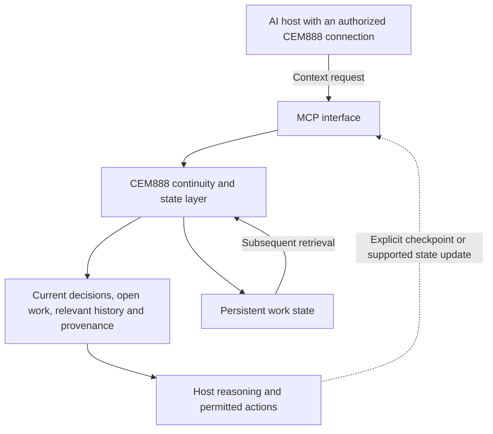

# Building Provider-Neutral AI Continuity Through MCP

**Evidence reviewed: September 9, 2026.**

**Status: IMPLEMENTED and TESTED for the scoped operations below; automatic host-wide continuity remains PLANNED / EXPLORATORY.** This is an engineering account of a working interface, its tests, and the gaps between an interface and a complete lifecycle. CEM888's runtime implementation remains proprietary.

## The problem: a conversation is not the work

An ongoing investigation has an objective, decisions, unresolved questions, and evidence. A conversation contains those things mixed with attempts, corrections, and obsolete assumptions. Starting another session or changing AI hosts can require reconstructing which parts still matter.

Our hypothesis is that the authoritative record of ongoing work should live outside an individual model conversation. A host should be able to ask what is current, reason with that state, and return the changes that should survive its session.

CEM888 is building that persistent state and control layer. MCP is the interface through which an external host can reach it. The protocol standardizes context and tool exchange; it does not determine how a host uses the returned context or manages its model lifecycle. That boundary is explicit in the [MCP architecture documentation](https://modelcontextprotocol.io/docs/learn/architecture).

## The architecture we expose



The dashed return path is conditional. It does **not** claim that every host automatically reports every completed turn. The [diagram source](./diagrams/mcp-continuity.mmd) is available separately.

The broader runtime includes context selection, execution controls, verification, and provider-neutral orchestration. Those concepts are described in the existing [architecture overview](./architecture.md) and [completion-verification case study](./case-study-completion-verification.md). The MCP connector exposes selected operations into that system; it does not automatically expose every native runtime capability or govern every tool the host owns.

## What we built

These are interface capabilities, not a promise that each installed host exposes the same tool catalogue.

| Capability | IMPLEMENTED | TESTED / evidence boundary |
|---|---|---|
| Task context | `cem_context_for` accepts a task and returns profile context, decisions, open work, history and provenance | Authenticated Codex reads observed during this review; relevance and payload size still need improvement |
| State and history reads | `cem_current_state`, `cem_open_work`, and `cem_recall` separate current decisions, unfinished work and historical retrieval | Live reads and retained host acceptance records |
| Explicit persistence | `cem_checkpoint` records a work summary and next actions; `cem_record_decision` supports explicit supersession; `cem_handoff` records work to resume | Checkpoint write/readback demonstrated; decision supersession covered by local regression tests |
| External-turn persistence | Begin/finish operations connect an explicitly supplied external exchange to the existing continuity lifecycle | Local retry tests and dated live acceptance records; not automatic ordinary-turn capture |
| Bounded state updates | A dedicated commit operation accepts a concise continuity delta; reconciliation can resubmit a missed update when enough visible state remains | Implemented and locally tested; retained Codex acceptance covers an explicit commit, retry and later retrieval |
| Application-managed completion | A controller can bracket a provider response with the existing continuity lifecycle | Source implementation and mocked-provider tests; live OpenAI completion acceptance is not established here |

A checkpoint is an explicit summary supplied to the state layer. Its existence does not establish that every claim inside it was independently verified. A decision record also needs appropriate user authority; a plausible model recollection should not silently become current truth.

## A continuity request, without private data

Consider an engineer returning to a release review. The following is a **synthetic tool-call example** using implemented public-facing input fields. It is not a captured customer request or a complete MCP wire message:

```json
{
  "name": "cem_context_for",
  "arguments": {
    "task": "Resume the release review: current decision and remaining checks",
    "limit": 3
  }
}
```

The connection supplies the authorized agent context. CEM888 reads the relevant state sources and returns a context response. The host can distinguish an active decision from a historical recollection, inspect provenance, and ask for more detail before continuing.

An abbreviated, **synthetic response projection** illustrates that distinction; it is not the full response schema:

```json
{
  "current_truth": [
    {
      "statement": "Release remains paused until the recovery check completes.",
      "status": "active"
    }
  ],
  "open_work": {
    "checkpoints": [
      {
        "objective": "Release review",
        "status": "active",
        "next_actions": ["Complete the recovery check and record the result."]
      }
    ]
  }
}
```

If that check is subsequently performed and its result is known, an explicit checkpoint can record the result and next action. A later state read can retrieve that checkpoint. This is a demonstrated interface workflow. Whether the host invokes the write after an ordinary conversation turn is a separate question.

There is also an important input caveat: the `limit` field in the observed context endpoint constrained memory matches, not the size of the entire response. A small result-count request was not a guarantee of a small bootstrap.

## What we tested

The evidence has different strengths. The live reads and local tests below were exercised during this review. Older host results are retained internal acceptance records reviewed for this article, not rerun certifications. Raw records remain private; the table is a sanitized, maintainer-reported account rather than an independently reproducible public benchmark.

| Date / surface | Observed result | What it does not establish |
|---|---|---|
| September 9 — Codex | Authenticated task-context and current-state calls succeeded. A state read returned checkpoints written earlier through the connector. A same-day retained audit receipt separately records an explicit checkpoint write followed by exact readback. | Automatic saving, fresh separate-account access, or customer-local installation parity |
| September 8 — Codex, retained acceptance | An explicit continuity update committed; a retry reported replay with unchanged single-write receipts; subsequent retrieval returned the event with host provenance. | Every ordinary Codex or ChatGPT turn being captured; independent recounting of all storage records in this review |
| August 8–9 — Claude, retained acceptance | A fact written through the external lifecycle was recalled in a fresh native session; a later native decision was retrieved in a new Claude chat without pasted history. | Universal Claude lifecycle automation, current reconnect reliability, or broad customer certification |
| September 9 — local regressions | **31 tests passed** across bootstrap, continuity and contract suites. **Two additional mocked-provider tests passed** for managed completion and response extraction. | Deployed behavior, live provider acceptance, or a comprehensive security assessment |

The regression coverage includes explicit supersession, retry handling, recovery at simulated persistence boundaries, no-durable-change behavior, and identity checks. Several lifecycle tests deliberately substitute test hooks. Passing them is useful engineering evidence, but is not a substitute for real storage and host tests. The [existing exactly-once state case study](./case-study-exactly-once-state.md) documents separate isolated persistence testing.

### A useful failure: relevant context was not necessarily compact

The live context audit exposed oversized responses and unrelated older material. That matters even when authentication and retrieval both work: excess history can obscure the decision the host actually needs.

A local repair prepared before this publication review selects a bounded bootstrap and makes omissions explicit. Replaying one captured live response through it produced **80.5% fewer serialized backing-envelope characters**. This is a single local replay measurement, not a token, latency, cost, or answer-quality benchmark. The repair was **not deployed** at the time of review, and a subsequent live read still returned the larger form. No runtime changes were made to improve the results for this article.

## The “breathing” state idea

We use “breathing” as a description of the intended state lifecycle: take in enough current information to work, then retain the useful changes rather than carrying every intermediate exchange into every future reasoning step. Durable history and active context serve different purposes. Superseded information can remain inspectable without remaining authoritative.

There are three distinct levels of evidence:

- **Inside the runtime:** context compilation and exclusion of inactive or superseded state exist in the inspected implementation. Native continuity through context boundaries also has a [published production case study](https://github.com/CEM888AI/agent-systems-lab/blob/main/case-studies/task-continuity-across-context-compression.md). That study explicitly limits its separate fresh-session memory-recall claim.
- **At the MCP interface today:** current-state reads, explicit updates, and a native lifecycle bridge exist. The simpler context-read endpoint has not demonstrated the same compact behavior in the deployed sample. Native context handling should not be used as proof of every MCP response path.
- **In deeper host integration:** reliably supplying state before substantive reasoning and capturing useful changes after completion remains a host-by-host engineering and acceptance problem.

The inspected external-turn path also supports declaring that a turn made no durable change, with regression coverage for skipping the content-persistence work. This does not mean the connector can independently determine the significance of every ordinary host message.

## What we deliberately do not send

The bounded state-update interface is designed around summaries, decisions, state changes and provenance. It does not require hidden chain-of-thought or system prompts. Separate explicit exchange-ingestion operations exist; they should not be confused with a requirement to replay lifetime conversation history on every read.

Retrieved context remains untrusted data under the receiving host's instruction and permission rules. This article's examples are synthetic. Private transcripts, personal profiles, operational identifiers, credentials, prompts, selection algorithms and runtime internals are deliberately excluded from the publication. These publication exclusions are not a claim that every current response path has passed a complete data-minimization or security audit.

## Where we are taking it: OpenAI and other hosts

We intend to submit and test the connector through OpenAI's current plugin/MCP ecosystem where eligible. As checked on September 9, OpenAI accepts remote MCP-only submissions with optional UI. The process calls for a stable public HTTPS service, verified publisher identity and submission permission, accurate tool metadata, public support/privacy/terms information, and at least five positive and three negative test cases. Submission starts review; approval and publication are subsequent steps. See the [official submission requirements](https://developers.openai.com/plugins/deploy/submission).

The engineering question is how much persistent work state can travel through a standardized host interface while CEM888 remains the continuity layer. We want to test reliable, user-authorized opportunities to supply context and persist observable results. Our evidence does not establish a guaranteed post-completion callback for ordinary ChatGPT conversations. A model-selected write action and an application-managed provider call are different integration modes.

Microsoft host configuration artifacts are also in development; real host acceptance is still pending. Claude and Codex have the specific dated evidence described above. The broader [cross-provider continuity track](./case-study-cross-provider-continuity.md) remains experimental. This write-up does not announce an OpenAI submission, approval, endorsement, partnership, or certified support for additional hosts.

## Current limitations and decision

**Decision: TESTED for explicit continuity operations; INCONCLUSIVE for universal automatic host continuity.**

- Tool availability differs between inspected source and the installed connector snapshot. A tool present in source is not necessarily callable in a particular host.
- Successful retrieval does not guarantee relevance, freshness, or complete coverage of the current task.
- Idempotent processing of an observed update cannot account for a turn the host never sends. Metrics for received events cannot establish the missing-event denominator.
- Reconciliation depends on sufficient visible state; it is not recovery of inaccessible conversation history.
- No new multi-customer isolation, authentication-longevity, clean-install parity or long alternating-host reliability test was performed for this article.
- The connector does not control a host's hidden compression, personality, or independent action permissions.

What has been demonstrated is narrower and useful: an external host can retrieve CEM888 work state, explicitly persist supported updates, and retrieve those changes later. Making that happen reliably around ordinary work in each host is the remaining integration challenge.

## Follow the work

Start with the [engineering case-study index](./README.md), [production evidence](https://github.com/CEM888AI/agent-systems-lab), or [CEM888's public site](https://cem888.ai). For evaluating a particular connector, ask for its current host-specific read, write, retry and fresh-session evidence. This repository publishes the evidence and interface discussion, not an installable copy of the protected runtime.
